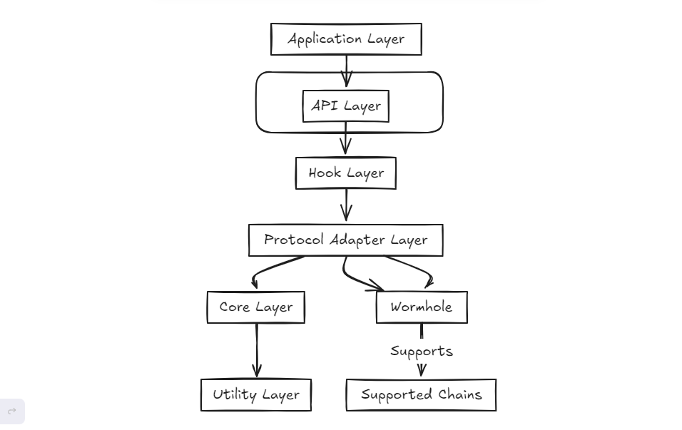

# CCIHS: Cross-Chain Interoperability Hooks for Solana

[](https://opensource.org/licenses/MIT)
<!-- [](https://github.com/yourusername/ccihs/actions) -->
<!-- [](https://crates.io/crates/ccihs) -->
<!-- [](https://docs.rs/ccihs) -->

## Overview

CCIHS (Cross-Chain Interoperability Hooks for Solana) is a middleware solution that simplifies and extends cross-chain development on Solana. It offers a unified API for multiple protocols, featuring a flexible hook system for custom logic injection. This architecture enables advanced use cases and optimizes for Solana's high-performance environment, making cross-chain development more accessible and powerful. In an increasingly interconnected blockchain ecosystem, CCIHS serves as a crucial transport network interface, enabling seamless interaction between Solana and other blockchain networks and thereby aims to revolutionize cross-chain communication for Solana-based applications.

## Problem with Cross chain Communication in Solana

Solana developers face significant challenges when creating applications that need to communicate with other blockchains. The process is complex, time-consuming, and prone to errors, also there is a lack of standardization in cross chain operations, so for instance it is hard to make a Wormhole Solana app interact with a LayerZero Solana app, as there is no unified interface for multiple cross-chain protocols. 

## Solution CCIHS offers

CCIHS is a Rust-based package that serves as a middleware layer for cross-chain development on Solana. At its core, CCIHS provides a robust and flexible framework that abstracts the complexities of cross-chain messaging. It leverages Solana's high-performance architecture while offering a standardized interface for interacting with various cross-chain protocols. This approach not only simplifies development but also future-proofs applications against changes in underlying cross-chain technologies. At the heart of CCIHS is our flexible hook system, which allows developers to inject custom logic at crucial points in the message lifecycle. Whether you need custom validation, logging, or complex transformations, our hook system makes it possible without altering the core code. This architecture enables advanced use cases while optimizing for Solana's high-performance environment.

## Architecture



CCIHS is built around several key components:

- **API Layer**: Provides a unified interface for developers to interact with CCIHS.
- **Core**: Manages the main cross-chain operations and orchestrates the flow between components.
- **Hooks**: Offers extensibility points for custom logic at various stages of message processing.
- **Protocol Adapters**: Abstracts different cross-chain communication protocols, allowing for easy integration of new protocols.
- **Config**: Handles system configuration and settings management.
- **Types**: Defines common types and structures used throughout the system.
- **Utility**: Provides supporting functions and tools used across the library.

This layered architecture ensures modularity, extensibility, and ease of maintenance. The API Layer interacts with the Core, which in turn coordinates with Hooks, Protocol Adapters, and other components to execute cross-chain operations efficiently.

### Key Features of CCIHS

1. **Protocol Abstraction**: A unified API supporting multiple cross-chain protocols (currently Wormhole, with plans for LayerZero and others), allowing seamless switching between protocols.

2. **Extensible Hook System**: Inject custom logic at various stages of the cross-chain communication process with pre-dispatch, post-dispatch, pre-execution, and post-execution hooks enabling advanced use cases like fee adjustments, message validation, and data transformations. 

3. **Solana Optimization**: Leverages Solana's high-speed, low-cost architecture for efficient cross-chain operations.

4. **Comprehensive Error Handling**: Robust error management and recovery mechanisms to enhance the reliability of cross-chain applications.

5. **Developer-Friendly Design**: Clear documentation, intuitive APIs, and helpful abstractions make cross-chain development more accessible.

6. **Security-First Approach**: Multiple layers of security checks to safeguard against common vulnerabilities in cross-chain interactions.

7. **Extensible Architecture**: Easily add support for new chains and protocols as the cross-chain ecosystem evolves.

These features combine to create a powerful, flexible, and secure framework for building cross-chain applications on Solana, streamlining the development process and enabling innovative use cases in the cross-chain space.

## Use Cases

CCIHS enables unique cross-chain applications that were previously difficult or impossible to implement. Here are some key use cases that showcase CCIHS's capabilities:

1. **Dynamic Cross-Chain Liquidity Routing**: 
   - Automatically route transactions through the most efficient cross-chain paths based on real-time liquidity and fee conditions.
   - CCIHS uses its hook system to check liquidity levels and fees across multiple chains before executing a transaction, optimizing for cost and speed.

2. **Cross-Chain State-Dependent Smart Contracts**: 
   - Create smart contracts that execute based on the state of multiple blockchains simultaneously.
   - Implement "meta-contracts" on Solana that listen for and verify state changes on multiple chains before execution.

3. **Distributed Cross-Chain Compute**: 
   - Distribute computational tasks across multiple blockchains based on their current load and gas prices.
   - CCIHS can split large computation tasks, distribute units to different chains for parallel processing, and aggregate results back on Solana.

4. **Cross-Chain Atomic NFT Breeding**: 
   - Enable NFTs from different blockchains to "breed" and create new, cross-chain heritage NFTs.
   - Verify ownership across chains, implement breeding algorithms on Solana, and mint new NFTs with provable multi-chain lineage.

5. **Blockchain-Agnostic Decentralized Identity with Progressive Trust**: 
   - Create a unified identity system that accumulates trust across multiple blockchains progressively.
   - Aggregate and validate identity attestations from multiple chains to create a comprehensive, cross-chain identity score.

6. **Cross-Chain Liquidity Backflow Prevention System**: 
   - Prevent arbitrage attacks that could drain liquidity from one chain to another in cross-chain DeFi protocols.
   - Monitor liquidity movements in real-time and automatically adjust fees or pause bridges to prevent attacks.

7. **Quantum-Resistant Cross-Chain Messaging**: 
   - Implement quantum-resistant security for cross-chain messages, future-proofing against potential quantum computing threats.
   - Utilize CCIHS's extensible architecture to incorporate post-quantum cryptographic algorithms in the messaging process.

8. **Cross-Chain Decentralized Sequencer for Layer 2 Solutions**: 
   - Create a decentralized sequencer for Layer 2 solutions that's secured by multiple Layer 1 blockchains.
   - Coordinate sequencing duties across multiple chains, implementing a round-robin system for proposing and validating sequence orders.

These use cases leverage CCIHS's unique capabilities, particularly its flexible hook system and ability to interact with multiple chains simultaneously. By providing a robust framework for these complex cross-chain operations, CCIHS empowers developers to build a new generation of interoperable blockchain applications that were previously unattainable.

<!-- 
1. **Cross-Chain DeFi Protocols**: 
   - Implement cross-chain lending and borrowing platforms where users can lend assets on one chain and borrow on another.
   - Create decentralized exchanges that aggregate liquidity from multiple chains, offering better rates and higher liquidity.

2. **NFT Bridges**: 
   - Build platforms that allow NFTs to move between Solana and other chains, expanding the reach and utility of digital collectibles.
   - Implement cross-chain NFT marketplaces, enabling users to buy, sell, and trade NFTs across different blockchain ecosystems.

3. **Cross-Chain Governance**: 
   - Develop DAOs that can execute governance decisions across multiple chains, allowing for more comprehensive and far-reaching organizational structures.
   - Create voting systems where tokens on different chains can participate in unified governance processes.

4. **Interoperable GameFi**: 
   - Design blockchain games where in-game assets and progress can be transferred between different chain-specific game versions.
   - Implement cross-chain tournaments and leaderboards, enhancing the competitive aspect of blockchain gaming.

5. **Multi-Chain Identity and Reputation Systems**: 
   - Build decentralized identity solutions that aggregate a user's reputation and activity across multiple blockchains.
   - Implement KYC/AML systems that work seamlessly across different chains.

6. **Cross-Chain Oracles**: 
   - Create oracle networks that can fetch and aggregate data from multiple chains, providing more comprehensive and accurate data feeds.
   - Implement cross-chain price feeds for DeFi applications, ensuring consistent pricing across different ecosystems.

7. **Interoperable Stablecoins**: 
   - Develop stablecoin systems that maintain consistent value and redeemability across multiple blockchain networks.
   - Create cross-chain collateralized debt positions (CDPs) where collateral on one chain can back stablecoins on another.

8. **Cross-Chain Yield Aggregators**: 
   - Build yield optimization platforms that can automatically move funds between different chains to maximize returns.
   - Implement strategies that leverage yield opportunities across multiple chains simultaneously.

9. **Blockchain Interoperability Layers**: 
   - Develop middleware solutions that enable seamless communication between different blockchain ecosystems.
   - Create cross-chain asset wrappers that represent assets from one chain on another, enhancing liquidity and usability.

10. **Multi-Chain Wallet Infrastructure**: 
    - Build wallet solutions that can manage assets and interactions across multiple chains from a single interface.
    - Implement cross-chain transaction batching and optimization services. -->

## Installation (still in development so won't work for now)

Add CCIHS to your `Cargo.toml`:

```toml
[dependencies]
ccihs = "0.1.0"
```

## Quick Start

Here's a comprehensive example of how to use CCIHS to set up a cross-chain communication system with custom hooks:

```rust
use ccihs::{
    CCIHSConfig, CCIHSAPI, CrossChainMessage, ChainId, ProtocolType,
    hooks::{HookType, ValidationHook, LoggingHook, EncryptionHook},
};

fn main() -> CCIHSResult<()> {
    // Step 1: Initialize CCIHS with a custom configuration
    let config = CCIHSConfig::new()
        .with_default_protocol(ProtocolType::Wormhole)
        .with_supported_chains(vec![ChainId::Solana, ChainId::Ethereum]);
    let mut ccihs = CCIHSAPI::new(config)?;

    // Step 2: Add custom hooks
    ccihs.add_hook(HookType::PreDispatch, Box::new(ValidationHook::new(1024))); // Max payload size of 1024 bytes
    ccihs.add_hook(HookType::PostDispatch, Box::new(LoggingHook::new()));
    ccihs.add_hook(HookType::PreExecution, Box::new(EncryptionHook::new([0u8; 32]))); // Example encryption key

    // Step 3: Create a cross-chain message
    let mut message = CrossChainMessage::new(
        ChainId::Solana,
        ChainId::Ethereum,
        "sender_address".to_string(),
        "recipient_address".to_string(),
        vec![1, 2, 3, 4], // Example payload
    );

    // Step 4: Send the message
    match ccihs.send_message(&mut message) {
        Ok(_) => println!("Message sent successfully"),
        Err(e) => eprintln!("Failed to send message: {}", e),
    }

    // Step 5: (Optional) Change the default protocol
    ccihs.set_default_protocol(ProtocolType::LayerZero)?;

    // Step 6: (Optional) Update configuration
    let new_config = CCIHSConfig::new()
        .with_default_protocol(ProtocolType::LayerZero)
        .with_supported_chains(vec![ChainId::Solana, ChainId::Ethereum, ChainId::Avalanche]);
    ccihs.update_config(new_config)?;

    Ok(())
}
```

This example demonstrates:

1. Initializing CCIHS with a custom configuration.
2. Adding custom hooks for validation, logging, and encryption.
3. Creating and sending a cross-chain message.
4. Changing the default protocol (e.g., from Wormhole to LayerZero).
5. Updating the CCIHS configuration.

## Documentation
For detailed documentation, please refer to our API docs.
## Examples
Check out the examples directory for more detailed usage examples.


## Contributing
We welcome contributions to CCIHS! Please see our Contributing Guide for more details.
## Testing
To run the test suite:
```bash
cargo test
```
## Benchmarks
To run benchmarks:
```bash
cargo bench
```
## Security
Security is of utmost importance in cross-chain communication. If you discover any security issues, please report them via our Security Policy.
## License
CCIHS is licensed under the MIT License. See the LICENSE file for details.

## Acknowledgements
CCIHS is built upon the work of many in the blockchain community. Special thanks to the teams behind Solana, Wormhole, and other cross-chain protocols that make this project possible.
<!-- ## Contact
For questions, suggestions, or discussions, please open an issue in this repository or contact the maintainers contact@gmail.com. -->

Built with ❤️ for the cross-chain future.